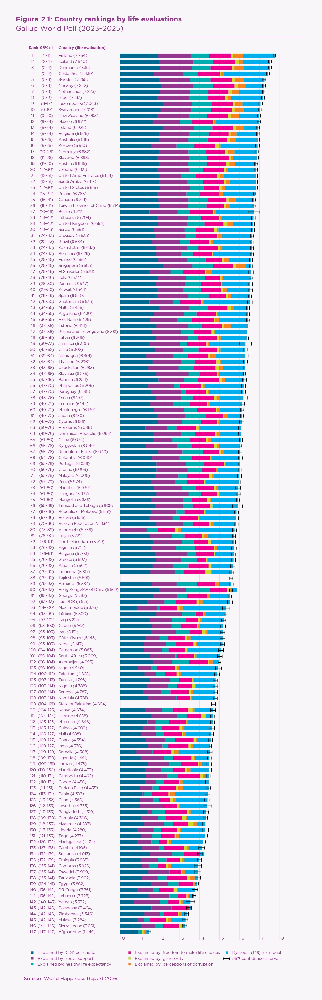
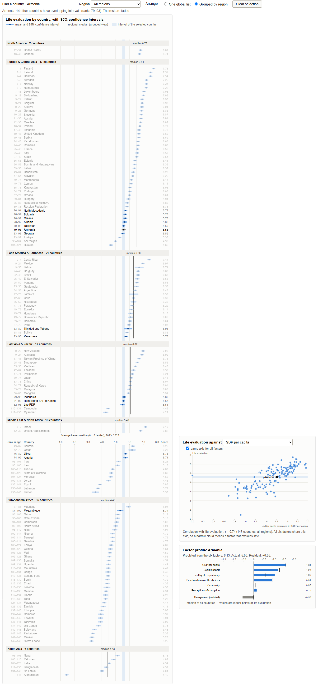

# Report

STATS 401 individual project: Visualization Critique and Redesign.
Interactive redesign: <https://blackcatyu.github.io/stats401-individual-project/>

## Original Visualization and Context

The visualization selected for this project is Figure 2.1, "Country rankings by life evaluations," from Chapter 2 of the World Happiness Report 2026 (Helliwell et al., 2026), published by the University of Oxford's Wellbeing Research Centre with Gallup and the UN Sustainable Development Solutions Network (Figure 1). It ranks 147 countries by their average 2023–2025 response to the Gallup World Poll's Cantril Ladder question, which asks people to rate their lives from 0 (worst possible life) to 10 (best possible life). Each country is drawn as a horizontal bar whose length encodes this average, with whiskers marking its 95% confidence interval and a bracketed range giving the confidence interval of its rank. Each bar is divided into seven colored segments. Six estimate how much log GDP per capita, social support, healthy life expectancy, freedom, generosity, and perceptions of corruption explain the score relative to "Dystopia," a hypothetical country with the world's lowest values on all six factors; the seventh combines Dystopia's baseline score with the country's unexplained residual.

  

**Figure 1.** The original visualization: Figure 2.1, "Country rankings by life evaluations," World Happiness Report 2026.

The figure carries two messages: which countries are happiest and least happy, with Finland ranked first and Afghanistan last, more than six points apart, and which social and economic factors are associated with these differences. Its audience is mixed. Journalists and the general public tend to read it as a "happiest countries" league table, while policymakers and researchers use it to reason about the drivers of well-being. Following the distinction between elementary and synoptic tasks adopted by Duncan et al. (2021), viewers should be able to perform elementary tasks, such as locating a country and comparing two countries while accounting for uncertainty, as well as synoptic tasks, such as comparing regions and understanding how the explanatory factors vary across all countries.

## Critique

The figure has two clear strengths. First, sorting countries by score and encoding totals as bar length from a common baseline uses the most accurately perceived visual channel (Cleveland & McGill, 1984), and the linear ordering supports systematic scanning, which Okoe et al. (2019) suggest is easier than searching an unconstrained two-dimensional layout. Second, unlike most popular rankings, the figure communicates statistical uncertainty explicitly through confidence intervals for both scores and ranks, allowing careful readers to judge whether two countries genuinely differ.

However, three weaknesses limit its effectiveness. First, the stacked bars imply a composition that does not exist. Stacking signals that parts sum to a whole, so readers naturally infer that the six factors produce each country's score. The authors themselves acknowledge that many readers mistakenly believe the rankings are built from these factors, when in fact they rest solely on survey responses. The final segment compounds the problem by merging a constant (Dystopia's score of 1.16) with a residual that can be either positive or negative, yet drawing it as an ordinary colored component. Because the figure is so widely shared, this invites causal misreadings at scale. Separating the measured score from the model-based explanation would remove this false additive reading.

Second, the explanatory factors cannot be compared across countries. Only the first segment starts from a common baseline; every other segment floats at a position determined by the segments before it, forcing viewers to compare unaligned lengths, a far less accurate perceptual judgment. Comparing social support in Denmark and Costa Rica, for example, requires mental subtraction. The color encoding makes this worse: the narrowest segments, such as generosity and corruption, are often only a few pixels wide, and Szafir (2018) shows that color differences become substantially harder to perceive as marks shrink, so even identifying which factor a thin segment represents is unreliable. Showing each factor on its own aligned axis would address both problems.

Third, the long rank-ordered list overstates small differences and hides regional structure. The top twenty countries span less than one point, and several mid-table countries have rank confidence intervals exceeding twenty-five places, yet the heavy bars make adjacent ranks look meaningfully different while the thin whiskers are easily overlooked. With 147 rows and no regional grouping, the static figure supports elementary lookups but leaves synoptic tasks, such as comparing regions, to the reader's memory. In a related geovisualization study, Duncan et al. (2021) found that synoptic tasks produced by far the highest error rates on static displays and that interactive support sharply reduced them. Encoding scores as dots with prominent intervals, grouping countries by region, and supporting filtering would better match both the true precision of the data and the regional comparison task.

## Redesign Rationale

The redesign (Figure 2) replaces the stacked chart with three linked D3.js views, each answering one weakness.

First, every score is drawn as a dot with a prominent 95% interval instead of a bar, and ranks are shown as ranges. Selecting a country shades its interval and fades every country whose interval does not overlap it. This addresses the third weakness: adjacent countries typically differ by about 0.02 points while intervals average 0.22 points wide, so the display now shows which differences the data can actually support.

Second, the explanatory factors are taken out of the bar. A scatter plot places one selected factor on a shared horizontal axis against life evaluation, and a profile panel draws the selected country's six factors as bars from a common baseline. The Dystopia constant is removed, so the residual is shown alone and can be negative. This addresses the first two weaknesses: factors are read as aligned positions, and they appear as correlates of the score rather than parts of it.

Third, countries can be grouped by World Bank region with a median line, filtered to one region, or found by search, and a single hue replaces the seven colors. Regions are therefore compared by position, which supports the synoptic task the original leaves to memory.

**Figure 2.** The redesign with Belize selected. Countries whose intervals overlap Belize's stay in full color.

## Original vs. Redesign

The redesign makes it easier to judge whether two countries genuinely differ, to compare one factor across countries, to see how strongly each factor is associated with life evaluation (r = 0.81 for social support but 0.04 for generosity), and to compare regions.

Some things are lost. The original shows every country's full breakdown at once in a static image that prints and shares easily; the redesign shows one factor, or one country's profile, at a time and depends on interaction. The list is still 147 rows long. Overlapping intervals are a visual heuristic rather than a formal test, and the rank ranges derived from them differ slightly from the published ones. Finally, two countries lack one factor in the source data and therefore have no residual.

## References

Cleveland, W. S., & McGill, R. (1984). Graphical perception: Theory, experimentation, and application to the development of graphical methods. *Journal of the American Statistical Association, 79*(387), 531–554.

Duncan, I. K., Tingsheng, S., Perrault, S. T., & Gastner, M. T. (2021). Task-based effectiveness of interactive contiguous area cartograms. *IEEE Transactions on Visualization and Computer Graphics, 27*(3), 2136–2152.

Helliwell, J. F., Layard, R., Sachs, J. D., De Neve, J.-E., Aknin, L. B., & Wang, S. (Eds.). (2026). *World Happiness Report 2026*. University of Oxford: Wellbeing Research Centre. https://www.worldhappiness.report/ed/2026/

Okoe, M., Jianu, R., & Kobourov, S. (2019). Node-link or adjacency matrices: Old question, new insights. *IEEE Transactions on Visualization and Computer Graphics, 25*(10), 2940–2952.

Szafir, D. A. (2018). Modeling color difference for visualization design. *IEEE Transactions on Visualization and Computer Graphics, 24*(1), 392–401.
